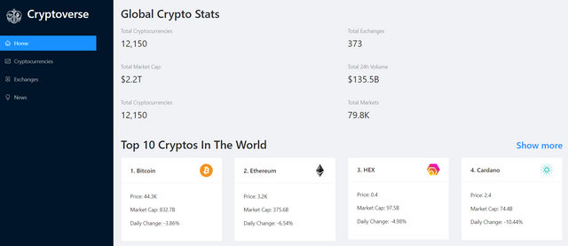

# Cryptoverse🪙

## General Info
**Cryptoverse is a react based web application which can give 100 crypto currencies details and latest news related to these currencies. 
Also we can get information of a specific coin like it's market cap, current price, daily change, price in USD & rank of coin.** 
<a href="https://cryptoverse-37.netlify.app//" target="_blank" >👉🎯👈</a>

***

Some key concepts that I refreshed in this project:
* React Basic (state, props, folder structure, functional components)
* Redux toolkit (for API integration)
* React Router
* Ant Design for UI
* Other Useful things (millify, chart.js, netlify)

## Available Scripts

In the project directory, you can run:

### `npm start`

Runs the app in the development mode.\
Open [http://localhost:3000](http://localhost:3000) to view it in your browser.

